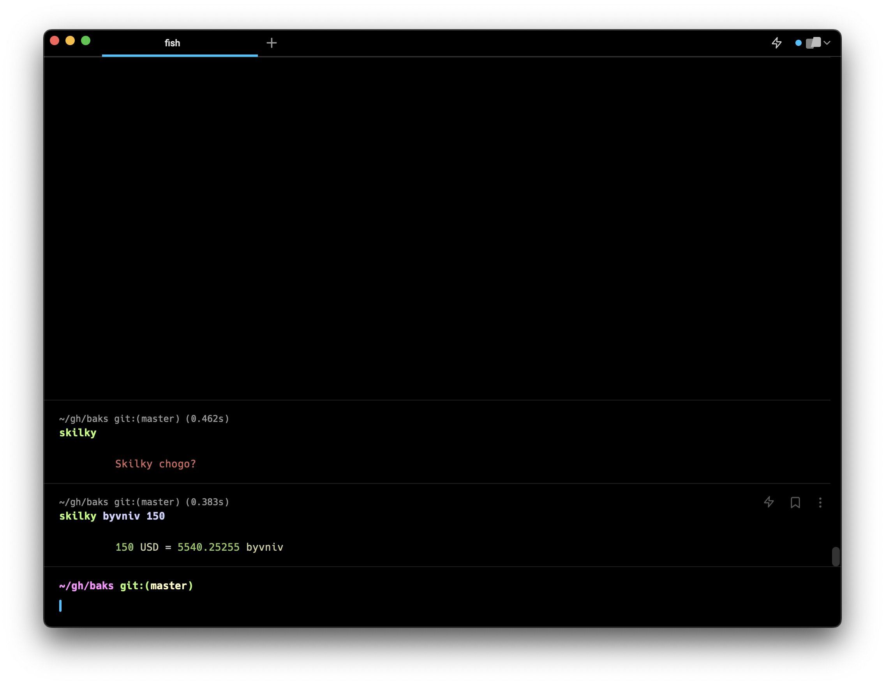

# baks
Get current USD to UAH exchange rate.




## Installing

```bash
npm i baks -g
```

or with yarn

```bash
yarn global add baks
```


## Usage

```bash
po chem dolar
```

```bash
skilky byvniv 150
```
